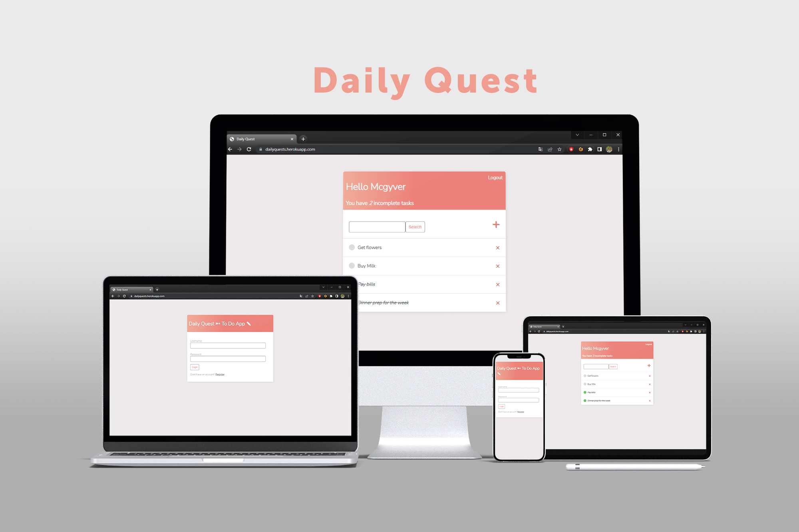
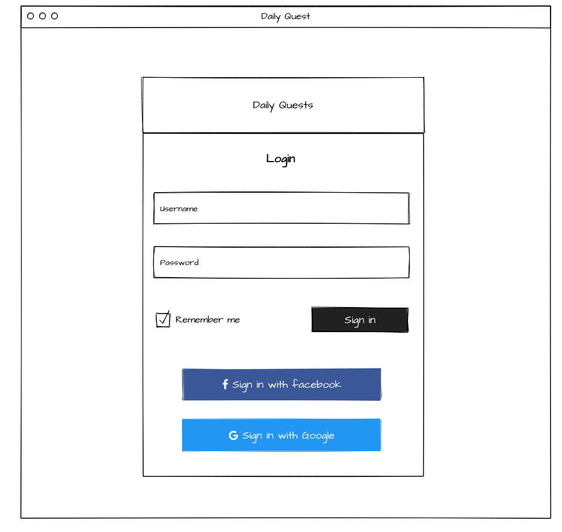
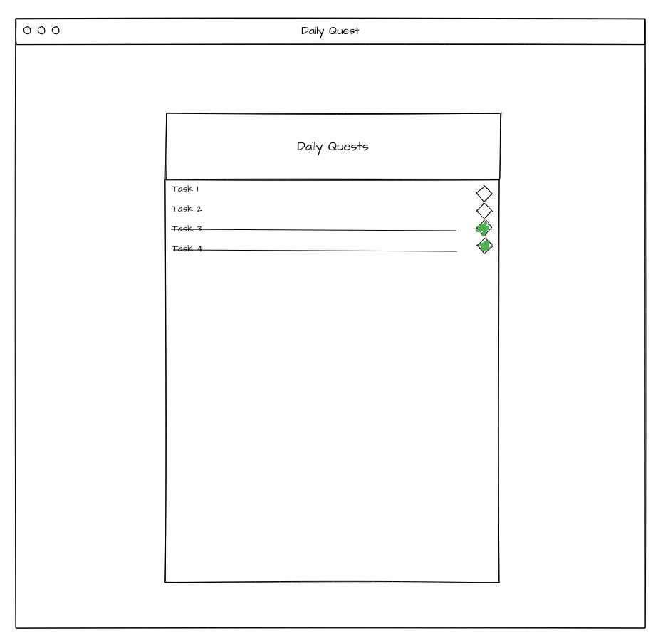
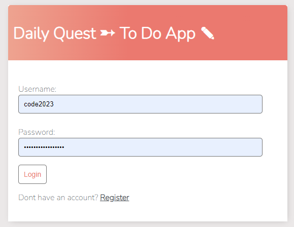
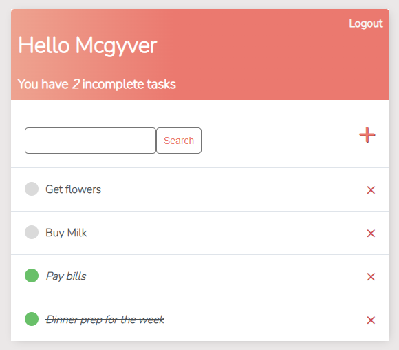
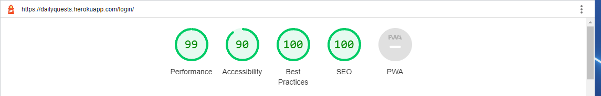

# DAILYQUEST
## Introduction
Dailyquest is a website built in Django using Python, CSS and HTML. It enables users to create tasks and completing them. It is targetted towards users who enjoy having a structure on a daily basis for their choirs. Users have the ability to create tasks, edit tasks, delete tasks, and create their own profile.

This is the fifth project for the Code Institute Diploma in Software Development.

The site provides role based permissions for users to interact with a central dataset. It includes user authentication, and Full CRUD functionality for Create Tasks, Delete Task, Update Task and Create User Profiles.

 </img>

## Table of Contents
## Table of Contents
* [User Experience Design (UX)](#UX)
    * [The Strategy Plane](#The-Strategy-Plane)
        * [Site Goals](#Site-Goals)
        * [User Story](#User-Story)
    * [The Scope Plane](#The-Scope-Plane)
    * [The Skeleton Plane](#The-Skeleton-Plane)
        * [Wireframes](#Wireframe-mockups)
* [Features](#features)
* [Technologies Used](#technologies-used)
* [Testing](#testing)
* [Deployment](#deployment)
* [Credits](#credits)

## UX
### The Strategy Plane
*  Dailyquest is intended to be a personal mobile based task manager for users to create, update, read and delete their daily quests.
##### The Sites Ideal User
* Anyone looking to organize their daily life and save time.
* Someone looking to keep track of their tasks
* Someone looking for a clean and simple application that helps with their daily choirs.

#### Site Goals

* To provide users with a good looking but very simple webpage to manage their daily quests!

#### User Story

1. As a User, I want to invite my friends, so we can enjoy this to do list app.
2. As a User, I want to organize my work, so I can feel more in control. 
4. As a User, I want to be able to understand my progress with my tasks. 
5. As a User, I want to be able to keep notes of my paid bills for the month. 
6. As a User, I want to show my wife of what i have left to do in the household before the weekend.
7. As a User, I want to be able to see what quests i have in my game to do before the weekly reset.
8. As a User, I want a reminder on how many tasks i have in a week or day.
9. As a User, I want to keep track of my studies.
10. As a User, I want to keep track of my movies that i have to watch.

#### Improvements

* Assist With Goal Setting
When users first enter your app or access a productivity feature, the first step they’ll need to take is to determine what they want to achieve. Otherwise, there won’t be anything specific to track.

* Show How Users Are Progressing
After users have set their goals, you can use stories to detail how they’re progressing. When users open the app every session, you can show a summary of the progress that compares the user’s actual progress with their goals. For instance, you can show a bar graph with one bar representing progress made for a particular goal, along with a bar representing the goal.

* Help Users Determine How to Achieve Their Goals More Effectively
While it’s important to continue encouraging users to meet their goals and engage with your app, you may be able to help them find shortcuts or other “hacks” that enable them to meet goals more easily.

* Continue Encouraging Users to Grow
The best productivity apps won’t simply encourage people to reach the goals they’ve set for themselves. Instead, they’ll inspire people to go beyond and continue progressing. As a result, users will be able to see how far they’ve come since they initially used the app and feel as though the app helped them get there.

#### Site Goals
* To provide users with a fun and simple layout 
* To ensure the site is fully accessible on desktop and touch enabled devices
* To ensure the site is fully compliant with keyboard commands and screen readers

### The Scope Plane

**Features planned:**

* User Profile - Create, Read, Update and Delete
* Posts - Users can create, read, update and delete their own Posts
* Other Users Posts - Users can read, like, and comment
* Profiles - Users can read other users profiles
* Users can logout of their account
* Users need to be registered and logged in to add a task
* Responsive Design - the site needs to be fully responsive to cover the wide variety of devices users may use to access the site
#### The Skeleton Plane
I used Adobe Photoshop to produce wireframes of how the site would look across different devices.

# Features
* Common Features
The site is designed with a central layout that the HTML inserts the relevant CSS into.

* Future Features
There will be an form added where you can order food that has different delivery options.

#### Preview
 </img>
 </img>

#### Validator Testing
* HTML
    * Main.html > Document checking completed. No errors or warnings to show.
    * This is mostly where all CSS and HTML is inherited from.

* Lighthouse 
  * The lighthouse report gave a great score of 99
  
  

* Python
  There was no issues with python code.
  Checked all python files while testing them individually on https://www.pythonchecker.com/

    #### Pythonchecker:
    * settings.py 
      100%,
      Guido,
      Lines: 145,
      Hints: 0,

    * views.py
      99%,
      Master,
      Lines: 89,
      Hints: 1,

    * urls.py
      53%,
      Solid,
      Lines: 15,
      Hints: 7,
      Majority hints are "Put whitespaces around operators" but it is url paths.

    * models.py
      100%,
      Guido,
      Lines: 18,
      Hints: 0,

    * admin.py
      100%,
      Guido,
      Lines: 5,
      Hints: 0,

  
#### Notable Bugs

Have not found any yet.
## Credits

1. codeinsitute.com
2. stackoverflow.com
3. w3schools.com

### Wireframe
* MockFlow - https://www.mockflow.com

#### Technologies Used

* Python
    * The following python modules were used on this project:
      * asgiref==3.5.2
      * cloudinary==1.30.0
      * dj-database-url==0.5.0
      * dj3-cloudinary-storage==0.0.6
      * Django==3.2.16
      * gunicorn==20.1.0
      * psycopg2==2.9.5
      * pytz==2022.5
      * sqlparse==0.4.3

#### Resources Used

* The Django documentation was used extensively during development of this project
* The Cloudinary documentation was used extensively during development to setup the configuration between django and the cloudinary apis
* The Code Institute reference material was used as a general reference for things that I had previously done during the course.
* All other resources used are referenced where appropriate.

### Deployment

The site was deployed via Heroku, and the live link can be found here - [DailyQuest](https://dailyquests.herokuapp.com/)

### Project Deployment

To deploy the project through Heroku I followed these steps:
* Sign up / Log in to [Heroku](https://www.heroku.com/)
* From the main Heroku Dashboard page select 'New' and then 'Create New App'
* Give the project a name - I entered theblogpp4 and select a suitable region, then select create app. The name for the app must be unique.
* This will create the app within Heroku and bring you to the deploy tab. From the submenu at the top, navigate to the resources tab.
* Add the database to the app, in the add-ons section search for 'Heroku Postgres', select the package that appears and add 'Heroku Postgres' as the database
* Navigate to the setting tab, within the config vars section copy the DATABASE_URL to the clipboard for use in the Django configuration.
* Within the django app repository create a new file called env.py - within this file import the os library and set the environment variable for the DATABASE_URL pasting in the address copied from Heroku. The line should appear as os.environ["DATABASE_URL"]= "Paste the link in here"
* Add a secret key to the app using os.environ["SECRET_KEY"] = "your secret key goes here"
* Add the secret key just created to the Heroku Config Vars as SECRET_KEY for the KEY value and the secret key value you created as the VALUE
* In the settings.py file within the django app, import Path from pathlib, import os and import dj_database_url
* insert the line if os.path.isfile("env.py"): import env
* remove the insecure secret key that django has in the settings file by default and replace it with SECRET_KEY = os.environ.get('SECRET_KEY')
* replace the databases section with DATABASES = { 'default': dj_database_url.parse(os.environ.get("DATABASE_URL"))} ensure the correct indentation for python is used.
* In the terminal migrate the models over to the new database connection
* Navigate in a browser to cloudinary, log in, or create an account and log in. 
* From the dashboard - copy the CLOUDINARY_URL to the clipboard
* in the env.py file created earlier - add os.environ["CLOUDINARY_URL"] = "paste in the Url copied to the clipboard here"
* In Heroku, add the CLOUDINARY_URL and value copied to the clipboard to the config vars
* Also add the KEY - DISABLE_COLLECTSTATIC with the Value - 1 to the config vars
* this key value pair must be removed prior to final deployment
* Add the cloudinary libraries to the list of installed apps, the order they are inserted is important, 'cloudinary_storage' goes above 'django.contrib.staitcfiles' and 'cloudinary' goes below it.
* in the Settings.py file - add the STATIC files settings - the url, storage path, directory path, root path, media url and default file storage path.
* Link the file to the templates directory in Heroku TEMPLATES_DIR = os.path.join(BASE_DIR, 'templates')
* Change the templates directory to TEMPLATES_DIR - 'DIRS': [TEMPLATES_DIR]
* Add Heroku to the ALLOWED_HOSTS list the format will be the app name given in Heroku when creating the app followed by .herokuapp.com
* In your code editor, create three new top level folders, media, static, templates
* Create a new file on the top level directory - Procfile
* Within the Procfile add the code - web: guincorn PROJECT_NAME.wsgi
* In the terminal, add the changed files, commit and push to GitHub
* In Heroku, navigate to the deployment tab and deploy the branch manually - watch the build logs for any errors.
* Heroku will now build the app for you. Once it has completed the build process you will see a 'Your App Was Successfully Deployed' message and a link to the app to visit the live site.

## Github Deployment

* The site was deployed to GitHub pages. The steps to deploy are as follows:
  * In the GitHub repository, navigate to the settings tab
  * Select the pages link from the setting menu on the left hand side 
  * Under the GitHub Pages from the source section drop-down menu, select the master branch 
  * One the master branch has been selected, the page will be automatically refreshed with a detailed ribbon display to indicate the successful deployment. 